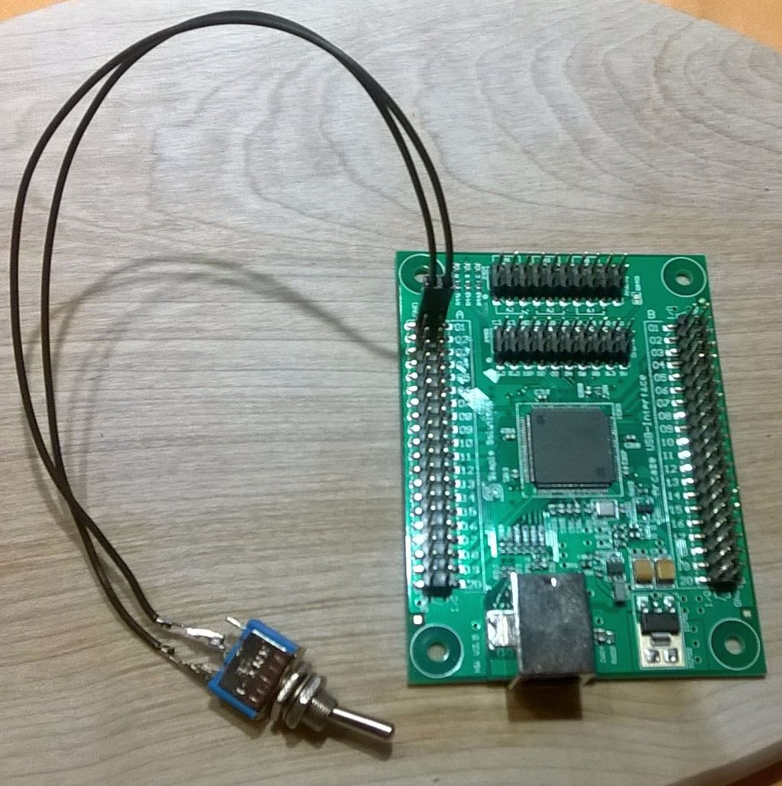

% Ein Arcaze USB ansteuern
% Carsten Lynker
% März 2015

# Individuelle Hardware auswerten und ansteuern

Früher oder später kommt einem der Wunsch mal ein eigenes Homecockpit zu bauen. Dabei gibt es den grundsätzlichen Weg, alle Bestandteile als fertige Lösungen zu erwerben und mit passenden Softwaretools an den Simulator zu binden. Das ist bequem, aber man hat den Nachteil, sich mit dem zu begnügen was der Markt bietet.

Leider ist gerade für die Fans der kleineren Flugzeuge (General Aviation) nicht viel an Hardware zu bekommen. Die meiste Hardware simuliert entweder einen großen Airliner (Airbus A320, Boing 747, ...) oder macht den Anschein, als wolle man mit Lego spielen, die Eltern haben einem aber stattdessen Duplo geschenkt.

Die Lösung für Individualisten ist klar, man baut sich seine Hardware einfach selbst. Und das geht viel einfacher als befürchtet, wie ich in diesem kleinen Einführungstutorial zeigen möchte.

## Warum ein Arcaze USB und kein Raspberry PI?

Zunächst haben wir zwei Entscheidungen zu treffen. Zum einen müssen wir uns eine Hardware aussuchen (Schalter, Anzeigen, Knöpfe, ...), zum anderen muss diese Hardware aber auch mit dem Flugsimulator verbunden werden, was zusätzliche Hardware erfordert.

Ein Weg kann sein, die eigene Hardware an ein Raspberry PI anzuschließen. Diese Minirechner bieten eine eindrucksvolle Leistung und vor allem einen Ethernet Anschluss. Damit können wir DataRefs in X-Plane per UDP Paketen beeinflussen (auslesen und auch schreiben).

Der große Nachteil ist jedoch, dass ein Raspberry PI 2 (das zur Zeit aktuelle Modell) nur über 26 nutzbare GPIO[^1] Pins verfügt. Dafür ist sein Preis mit ca. 40 EUR sehr gering. Hinzu kommt noch ein Micro-USB Netzteil (5V DC, 2A), die Gesamtkosten liegen dann bei knapp 50 EUR für 26 nutzbare GPIOs.

[^1]: GPIO = General Purpose Input Output

Ein riesiger Vorteil des Raspberry PI ist natürlich seine enorme Verbreitung. Man bekommt scheibar unendlich viele Codebeispiele im Internet, eine helfende Community ist auch schnell gefunden. Wie einfach die Programmierung sein kann sieht man z. B. auf den [Beispielseiten](http://www.raspberrypi.org/learning/quick-reaction-game/worksheet/) der Raspbarry PI Foundation.

Für den Simulator Nutzer hat das Raspberry PI jedoch einen Nachteil, es besitzt keinen Ausschalter. Man muss es zusätzlich zum Rechner, auf dem X-Plane läuft, einschalten und booten lassen. Danach wird das Herunterfahren etwas umständlich - oder man lässt die ca. 3W einfach dauerhaft laufen, die Stromkosten sind mit unter 10 EUR jährlich überschaubar.

Anders die Platine Arcaze USB des Herstellers [Simple Solutions](http://www.simple-solutions.de/de/index.php). Hier bekommt man 40 Pins zum etwa gleichen Preis. Damit lassen sich also 40 statt 26 Schalter realisieren. Zusätzlich lassen sich Erweiterungen anschließen, um z. B. 7-Segment-Anzeigen anzusteuern (was beim Raspberry PI ebenfalls möglich ist).

Um das Ein- und Ausschalten des Arcaze USB müssen wir uns gar keine Gedanken machen. Wir stecken das Modul über das mitgelieferte USB Kabel einfach in einen freien USB Steckplatz unseres Rechners, auf dem X-Plane läuft. Die Stromversorgung wäre damit auch schon erledigt, falls wir nicht sehr hungrige Hardware verbauen. Um Schalter oder Drehimpulsgeber auszuwerten reicht die Versorgung über den einen USB-Port völlig aus. Auch rote LEDs bzw. 7-Segment-Anzeigen sind so genügsam, dass wir sie in geringer Anzahl ohne weitere Stromversorgung betreiben können.

## Das Arcaze USB und der PC

Ein Arcaze USB verhält sich von sich aus zunächst wie eine USB-Tastatur. Als solche wird es erkannt, jedoch ohne weitere Folgen. Mit dem mitgelieferten Programm könnte man nun Makros im Arcaze programmieren, sodass z. B. ein Schalterwechsel einen Tastendruck produziert. Damit lässt sich das Arcaze USB an nahezu alle Software ankoppeln. Wer will könnte sich einen Schalter "Battery" und einen Taster "Master Warning" basteln. Ist der Schalter "Battery" in Stellung "off" und man drückt den Taster, so könnte das Arcaze USB "Mit freundlichen Grüßen" schreiben, falls man es neben der Flugsimulation auch noch für die E-Mails nutzen will.

## Das Arcaze USB und die Flugsimulatoren

Die Platinen von Simple Solution lassen sich mit den gängigen Flugsimulatoren koppeln. Beim Microsoft Simulator verwendet man dazu das Plugin FSUIPC, bei X-Plane funktioniert XPUIPC. Hinzu kommt eine Kopplungssoftware, wie sie vom Hersteller in einem [Videotutorial](http://wiki.simple-solutions.de/de/products/Arcaze/Arcaze-USB/Arcaze_Video_Tutorials) gezeigt wird.

## Das Arcaze USB und X-Plane

Zur Ansteuerung des Arcaze USB lässt sich FlyWithLua ab Version 2.3 verwenden. Wie das genau geht werden die folgenden beiden Beispiele zeigen.

# Zwei Beispiele individueller Hardware

## Ein einfacher Schalter

Am Beispiel eines einfanchen Schalters soll der grundsätzliche Umgang mit dem Arcaze USB gezeigt werden, inklusive der Programmierung in FlyWithLua.

Das folgende Bild zeigt unseren Aufbau.

Das Arcaze USB besitzt zwei Pfostenreihen mit je 40 Pins. Davon sind jeweis die 20 äußeren Pins mit GND verbunden, die inneren sind die eigentlichen IO-Pins. Sie sind bezeichnet mit "A01", "A02", ... , "A20" und auf der gegenüberliegenden Seite mit "B01" bis "B20".

Unseren Schalter verbinden wir nun mit einem der GND Pins sowie den Pin A01. Standardmäßig sind alle IO-Pins als Eingänge definiert. Pull-Up und -Down Widerstände sind entsprechend gesetzt. Wenn wir einen Pin offen lassen, dann liefert er den Zustand 0, ist er auf GND gelegt, so zeigt er den Zustand 1.

### Die Kopplung zwischen Arcaze USB und X-Plane

Wir schreiben uns ein kleines Lua Script. Zunächst müssen wir das Arcaze USB mit dem Flugsimulator koppeln, bzw. anders ausgedrückt wir brauchen eine Verbindung zur Platine von Lua aus. Dazu laden wir zunächst die Bibliothek **arcaze.lua** in unserem Skript:

	require "arcaze"

Das gibt uns die passenden Funktionen an die Hand um mit dem Arcaze kommunizieren zu können. Zunächst müssen wir das Arcaze USB finden und einen Zeiger auf das Gerät erzeugen (klingt kompliziert, wer es nicht so genau versteht, einfach nicht weiter darüber nachdenken). Mit dem Zeiger können wir dann später den Funktionen mitteilen, auf welchem Arcaze sie ihre Wirkung entfalten sollen. Und ja, das bedeutet wir können mehrere Arcaze gleichzeitig anschließen und jedes eigenständig steuern.

Hier nehmen wir jedoch an, es gibt nur ein einziges Arcaze USB. Wir erzeugen den Zeiger mit diesem Befehl:

	local my_arcaze = arcaze.open_first_device()

Die Bezeichnung "local" könnten wir auch weglassen. Würde aber ein anderes Script die gleiche Variable "my_arcaze" für andere Zwecke verwenden, hätten wir einen Konflickt, der vermutlich Lua zum Absturz, mindestens aber zu unvorhergesehenen Handlungen bringen würde. Daher verwenden wir wo immer es geht lokale Variablen!

Jetzt habe wir einen Zeiger auf der erstbeste Arcaze USB, welches an unserem USB System angeschlossen ist.

### DataRefs definieren

Der Schalter soll in X-Plane eine Wirkung zeigen. Als Beispiel soll er hier die Batterie ein- oder ausschalten. Um das in X-Plane erreichen zu können eignen sich DataRefs hervorragend. Wir sehen uns die [Liste der verfügbaren DataRefs](http://www.xsquawkbox.net/xpsdk/docs/DataRefs.html) an und finden etwas passendes:

	dataref("battery", "sim/cockpit/electrical/battery_on", "writable")

Dadurch können wir ab sofort die Variable battery verwenden, sie ist direkt an X-Planes DataRef gekoppelt.

### Regelmäßige Schalterabfrage

Wir wollen unseren Schalter nun regelmäßig abfragen lassen. Dazu erzeugen wir eine Funktion mit aussagekräftigem Namen. Das hilft die Anweisung, die der Befehl do_every_frame() sammelt, übersichtlich zu halten. Anschließend lassen wir die Funktion bei jedem Frame ausführen.

	function arcaze_battery_switch()
		battery = arcaze.read_pins( my_arcaze )
	end
	
	do_every_frame("arcaze_battery_switch()")

Die Funktion arcaze.read_pins() liefert alle Werte der Pins (0 wenn offen, 1 wenn mit GND verbunden) von A01 bis B20.

Weil wir den Schalter auf Pin A01 gesteckt haben und entweder 0 oder 1 im DataRef haben wollen, können wir einfach die Variable battery füllen lassen. Sie ist mit dem DataRef gekoppelt, sodass FlyWithLua sich um den Rest kümmert und wir im Prinzip fertig sind.

Es gibt nur eine Problematik. Wenn gar kein Arcaze USB angeschlossen ist, dann liefert die Funktion arcaze.open_first_device() keinen Zeiger. Die Funktion arcaze.read_pins() weis nun nicht was sie denn auslesen soll und Lua beendet sich mit einer Fehlermeldung. Das wäre nicht weiter tragisch, falls wir das Arcaze USB immer angeschlossen lassen. Wir können aber alternativ auch überprüfen, ob arcaze.open_first_device() überhaupt eine Platine gefunden hat. Das Script sieht dann vollständig so aus:

	local my_arcaze = arcaze.open_first_device()
	
	if my_arcaze == nil then
		logMsg("FlyWithLua Error: Kein Arcaze USB gefunden!")
	else
		dataref("battery", "sim/cockpit/electrical/battery_on", "writable")

		function arcaze_battery_switch()
			battery = arcaze.read_pins( my_arcaze )
		end

		do_every_frame("arcaze_battery_switch()")
	end

Falls wir kein passendes Arcaze USB finden, so schreiben wir eine Meldung in die Entwicklerkonsole (die Datei Log.txt von X-Plane). Andernfalls führen wir das Script aus.

## Ein Radio für die COM1 Frequenz

Nun wollen wir ein deutlich komplexeres Beispiel umsetzen und entfernen den Schalter von A01. Stattdessen nutzen wir einen doppelten Drehimpulsencoder mit Tastfunktion. In unserem Fall den [E37](http://www.elma.com/de-eu/products/rotary-switches/rotary-switching-products/product-pages/type-e37-detail/) des Herstellers ELMA.

Elektrisch ist der Anschluss etwas umfangreicher. Zunächst sehen wir im [Datenblatt](http://www.elma.com/~/media/product-files/region-emea/rs/02-rotary-encoders/type-e37/document/ch14-rs-dual-concentric-encoder-typee37-datasheet-d.ashx?la=de-eu) nach, wie die Pins am E37 belegt sind. Wie aus den Daten zu entnehmen ist, müssen wir die Pins 3, 4 und 9 des E37 mit GND verbinden. Dazu löten wir die Pins einfach zusammen und führen ein Kabel vom E37 zu einem beliebigen GND Pin des Arcaze USB. Die Pins 6 und 10 legen wir auf die IO-Pins A01 und A02 des Arcaze, die Pins 1 und 5 legen wir auf A03 und A04, und Pin 2 verbinden wir mit A05.

Das folgende Bild zeigt den Aufbau, wobei hier schon zwei Anzeigen mit angeschlossen sind, die wir momentan noch außer Acht lassen. A01 ist hier nun rechts unten zu sehen, da das Arcaze USB nun mit dem USB-Anschluss nach oben auf dem Bild zu sehen ist.

Gut erkennen kann man, wie die GND Anschlüsse bereits am E37 zusammen gelötet sind, und mit einem beliebigen GND Anschluss des Arcaze USB verwunden wurden.

### Den Taster zum Leben erwecken

Beginnen wir unser Script mit dem Taster des Drehgebers. Den Code sollten wir bereits verstehen.

	local my_arcaze = arcaze.open_first_device()
	
	if my_arcaze == nil then
		logMsg("FlyWithLua Error: Kein Arcaze USB gefunden!")
	else
		-- wir verwenden zwei DataRefs und einen lokalen Merker
		dataref("NEW_COM1", "sim/cockpit2/radios/actuators/com1_frequency_hz_833", "writable")
	    dataref("NEW_COM1_STDBY", "sim/cockpit2/radios/actuators/com1_standby_frequency_hz_833", "writable")
	    local last_radio_push_button = 0

		function little_arcaze_radio()
			-- der Taster liegt erst an Position A05, A01 bis A04 bleiben ungenutzt
			_, _, _, _, radio_push_button = arcaze.read_pins( my_arcaze )

			-- bei positiver Flanke den Tausch der Werte vornehmen
			if (last_radio_push_button == 0) and (radio_push_button == 1) then
				local temp_value = NEW_COM1
				NEW_COM1 = NEW_COM1_STDBY
				NEW_COM1_STDBY = temp_value
			end

			-- Werte für nächsten Durchgang merken
			last_small_radio_wheel = small_radio_wheel
		end
	
		do_every_frame("little_arcaze_radio()")
	end

Spannend ist hier die Zeile, wo wir die Pins des Arcaze USB abfragen. Da wir A05 auslesen wollen, haben wir für die ersten vier übergebenen Werte (die von A01 bis A04) keine Verwendung. Wir lassen sie verpuffen, indem wir statt einer Variablen den Unterstrich verwenden. Das ist eine in Lua beliebte Methode nicht benötigte Rückgabewerte ins Leere laufen zu lassen.

Ich habe zudem den Tausch der beiden Werte für NEW_COM1 und NEW_COM1_STDBY klassisch mit einer temporären Hilfvariablen umgesetzt. So wird es in den meisten Programmierkursen vermittelt. Lua würde aber auch hiermit klarkommen:

	if (last_radio_push_button == 0) and (radio_push_button == 1) then
		NEW_COM1, NEW_COM1_STDBY = NEW_COM1_STDBY, NEW_COM1
	end

Dabei werden die Werte in den Stack gelegt und anschließend vertauscht wieder zugeordnet. Das sieht eleganter aus und wer mag kann diesen Code verwenden.

Die neuen DataRefs stehen ab X-Plane 10.30 zur Verfügung und geben den Wert endlich in kHz an, nicht in 10 kHz wie zuvor. Dies nur als Anmerkung für dijenigen, die schon länger an X-Plane programmieren.

### Drehimpulsgeber auswerten

Nun wollen wir die beiden Drehimpulsgeber auswerten. An einem Arcaze USB müssen die Kanäle A und B eines Drehimpulsgebers immer mit zwei Pins A01 und A02, A03 und A04, A05 und A06, usw. verbunden werden. Sie bilden dann Encoderwerte E01, E02, E03, ..., E20, wobei E20 die Pins B19 und B20 auswertet. Wir nutzen die ersten beiden Encoderwerte:

	big_radio_wheel, small_radio_wheel = arcaze.read_encoders( my_arcaze )

Mit der Funktion arcaze.read_encoders() werden die Werte E01 bis E20 zurück geliefert. Diese Werte sind Ganzzahlen von 0 bis 65535. Beim Starten des Arcaze USB werden diese Werte nicht initialisiert, sie können irgendeinen Wert aufweisen.

Wichtig ist, dass man die Werte beobachtet und mit den Werten aus der vorhergehenden Abfrage vergleicht.

Hier mal der komplette Codeausschnitt für den größeren Encoder:

	local big_radio_wheel, small_radio_wheel, radio_push_button, wheel_diff

	-- Werte auslesen
	big_radio_wheel, small_radio_wheel = arcaze.read_encoders( my_arcaze )

	-- Bei Änderung tätig werden
	if not (last_big_radio_wheel == big_radio_wheel) then
		-- Differenz ermitteln
		wheel_diff = last_big_radio_wheel - big_radio_wheel

		-- Nullübergänge abfangen
		if wheel_diff >  60000 then wheel_diff = wheel_diff - 65536 end
		if wheel_diff < -60000 then wheel_diff = wheel_diff + 65536 end

		-- Wir haben 4 Flanken pro Schritt
		wheel_diff = wheel_diff / 4

		-- Die Standby Frequenz in MHz Schritten ändern (1 MHz = 1000 kHz)
		NEW_COM1_STDBY = NEW_COM1_STDBY + wheel_diff * 1000

		-- Wertebereich für COM sicherstellen
		if NEW_COM1_STDBY < 118000 then NEW_COM1_STDBY = 136975 end
		if NEW_COM1_STDBY > 136975 then NEW_COM1_STDBY = 118000 end
		
		-- Wir wollen ein Vielfaches von 25 kHz
		NEW_COM1_STDBY = NEW_COM1_STDBY - NEW_COM1_STDBY % 25
		
		-- Werte für nächsten Durchgang merken
		last_big_radio_wheel = big_radio_wheel
	end

Der komplette Code liegt im Script **new little arcaze radio.lua** vor. Dort kann man sehen wie der innere, kleinere Drehknopf ausgewertet wird. Das Verfahren ist identisch.

Wie man leicht erkennen kann, ist die Programmierung eines Drehimpulsgebers schon eine Spur anspruchsvoller. Wir müssen die Werte auslesen, mit denen des vorherigen Durchgangs in Beziehung bringen und den Sprung ..., 65534, 65565, 0, 1, 2, ... beachten. Zudem zählt der Wert die Anzahl der gemessenen Flanken, die meisten Drehimpulsgeber liefern vier Flangen pro Rastung.

Die zweite Hälfte des Codeausschnittes befasst sich dann aber mit dem DataRefs, denn wir müssen die Regeln für eine COM Frequenz einhalten, sonst drehen wir über 137 MHz hinaus oder gelangen an Werte außerhalb des 25 kHz Rasters, falls unser Drehimpulsgeber unsauber arbeitet. Man sollte Werte im Simulator nicht einfach überschreiben, sondern sich Prüfungen dieser Art grundsätzlich angewöhnen.

### Die 7-Segment-Anzeigen

Am spannensten sind sicher die 7-Segment-Anzeigen. FlyWithLua nimmt einem hier jede Menge Arbeit ab. Dennoch bleibt ein wenig zu tun.

Zunächst müssen wir dem Display Driver 32 mitteilen, wo wir Anzeigen angesteckt haben. In unserem Beispiel an den Steckplättzen 1b und 3a der Display Driver 32 Platine.

Auf das Zusammenstecken werde ich nicht weiter eingehen. Die Flachbandkabel werden mitgeliefert. Es ist darauf zu achten die rote Ader immer an Pin 1 zu stecken. Pin 1 erkennt man an einer Einbuchtung der weißen Umrandung des Steckers oder einer Zahl 1 in einem Kreis. Da der Zusammenbau nicht X-Plane spezifisch ist, kann man die detaillierten Anleitungen zum Display Driver 32 vom Hersteller Simple Solution nutzen.

Die Initialisierung erreichen wir mit folgenden Zeilen:

	arcaze.init_display( my_arcaze, "1b" )
    arcaze.init_display( my_arcaze, "3a" )

Man übergibt der Funktion arcaze.init_display() als erstes Argument den Zeiger auf die Arcaze USB Platine. An diese ist der Display Driver 32 angeschlossen, eine direkte Verbindung zur Treiberplatine per USB haben wir nicht, das Arcaze USB leitet unser Anliegen weiter. Der zweite Parameter benennt die Schnittstelle des Treibers, an die wir das Display angesclossen haben als Zeichenkette. Hier also einmal "1b" und "3a".

Das ist ein möglicher Weg, aber es gibt einen noch spannenderen:

    dataref("INSTRUMENT_BRIGHTNESS", "sim/cockpit/electrical/instrument_brightness", "readonly")

	arcaze.init_display( my_arcaze, "1b", INSTRUMENT_BRIGHTNESS*15 )
    arcaze.init_display( my_arcaze, "3a", INSTRUMENT_BRIGHTNESS*15 )

Man kann nämlich noch einen dritten Parameter übergeben, die gewünschte Helligkeit. Sie ist ein Ganzzahlenwert von 0 (nahezu aus) bis 15 (volle Leuchtkraft). Da X-Plane einen DataRef für die Instrumentenhelligkeit bereithält, der einen Wertebereich von 0.0 bis 1.0 besitzt, multiplizieren wir ihn mit 15. Und keine Angst, FlyWithLua übersetzt korrekt in eine Ganzzahl. Die absichtliche Schlampigkeit bei Zahlenwerten ist ja eines der Charakterzüge von Lua.

Wird die Initialisierung regelmäßig durchgeführt, kann man die Helligkeit der Anzeigen live an das simulierte Cockpit in X-Plane koppeln. Drehr man mit der Maus am virtuellen Knopf für die Helligkeit der Instrumente, so werden auch die gebastelten Hardware-Anzeigen
heller oder dunkler.

Jetzt brauchen wir nur noch regelmäßig die Werte auf das Display senden. Dazu haben wir folgende Möglichkeit:

	arcaze.show(my_arcaze, "3a", "125.400")

Damit würden wir die Zahl 125.400 auf das Display 3a schreiben. FlyWithLua kümmert sich um den Dezimalpunkt. Verwenden dürfen wir folgende Ziffern/Zeichen: "0123456789 .-", also alle Ziffern, ein Leerzeichen, den Punkt und ein Minus. Bei einem Leerzeichen bleibt sie 7-Segment-Anzeige leer, den Punkt kann man einmalig verwenden. Nicht zulässig sind daher "FL120" oder "14:39:07" oder auch "14.39.07". In einer späteren Fassung des arcaze.lua Moduls sind die zusätzlichen Zeichen "corAEFHJLP", damit wären "HELP", "Error" oder "FL095" durch die 7-Segment-Anzeigen darstellbar.

Jetzt kommt noch eine Besonderheit:

	arcaze.show(my_arcaze, "1b", "  123.825")

Bei den Steckplätzen 1b, 2b, 3b und 4b wird linksbündig geschrieben, aber es werden die verwendeten Ziffern rechtsbündig aus einem acht Ziffern langen String entnommen. Daher setzen wir zwei Leerzeichen voran, denn wir haben nur eine Anzeige aus 6 Elementen. Wem das zu kompliziert ist, der verwendet einfach nur die Steckplätze 1a, 2a, 3a und 4a.

Eine weitere Besonderheit ist nämlich, dass der Treiber 1a und 1b aus einem gemeinsamen Speicher von 8 Zeichen Länge füllt. Die Anzeige 1b wird aber quasi von hinten herum dargestelllt. FlyWithLua löst dies mit der Rechtsbündigkeit auf 8 Stellen. Hätte man obigen Befehl abgesetzt und an 1a eine weitere Anzeige mit 6 Stellen angeschlossen, so würde dort dann "8.321  " angezeigt, auf 1b korrekt "123.825".

Wie man das umgeht und alle acht Ausgänge verwendet, das verrät das Handbuch. Für eine Einführung geht es zu weit, man merke sich einfach, solange genug Plätze vorhanden sind, nimmt man die "a" Plätze zum Aufstecken.

## Mehrere Arcaze USB Platinen verwenden

Solange man nur eine Arcaze USB Platine verwendet ist die Nutzung relativ einfach, schwierig wird es erst wenn man mehrere Platinen ansteuern möchte. Denn dann hilft die Funktion arcaze.open_first_device() nicht mehr weiter. Wir müssen die einzelnen Arcaze Platinen trennen.

Hilfreich hierbei ist die HID Tabelle, die FlyWithLua uns bereitstellt. Sie ist eine vordefinierte Tabelle und kann mit einer for-Schleife durchsucht werden. Stoßen wir dabei auf eine der Arcaze Platinen, so können wir diese gezielt zuordnen.

Als erste Maßnahme lassen wir FlyWithLua eine Debug-Datei erstellen (Menü *Plugins* -> *FlyWithLua* -> *Write Debug file*). Wir finden die Datei danach im Hauptverzeichnis von X-Plane, dort wo auch die X-Plane eigene Datei *Log.txt* liegt. Wir suchen nach *FlyWithLua_Debug.txt*. In ihr finden wir auch alle HID Geräte. Hier die Meldung für ein frisch ausgepacktes Arcaze USB:

	ALL_HID_DEVICES[13].vendor_id         = 5776 (0x1690)
	ALL_HID_DEVICES[13].product_id          = 65043 (0xfe13)
	ALL_HID_DEVICES[13].release_number      = 1381 (0x565)
	ALL_HID_DEVICES[13].interface_number    = -1 (0xffffffff)
	ALL_HID_DEVICES[13].usage_page          = 1 (0x1) Generic Desktop Controls
	ALL_HID_DEVICES[13].usage               = 6 (0x6) Keyboard
	ALL_HID_DEVICES[13].path                = \\?\hid#vid_1690&pid_fe13#6&1126067e&0&0000#{4d1e55b2-f16f-11cf-88cb-001111000030}
	ALL_HID_DEVICES[13].serial_number       = 000472300000
	ALL_HID_DEVICES[13].manufacturer_string = Simple Solutions    
	ALL_HID_DEVICES[13].product_string      = Arcaze V5.65
	ALL_HID_DEVICES[13] can be opened by FlyWithLua.

In diesem Beispiel ist es Eintrag 13, der auf das Arcaze USB zeigt. Das könnten wir jetzt ausnutzen:

	my_radio_panel = hid_open_path(ALL_HID_DEVICES[13].path)

Es wäre jedoch eine katastrophale Situation, wenn unser Script immer das 13. Gerät öffnen würde, denn dabei handelt es sich nicht zwangsläufig um das Arcaze, die Position kann sich schon ändern, wenn man einen USB Speicherstick einstöpselt und das Betriebssystem neu mischt. Daher durchsuchen wir die Tabelle aller HID Geräte nach unserer Platine:

	for i, dev in ipairs(ALL_HID_DEVICES) do
		if (dev.vendor_id == 5776) and (dev.product_id == 65043) then
			if my_first_arcaze == nil then
				my_first_arcaze = hid_open_path(dev.path)
			else
				my_second_arcaze = hid_open_path(dev.path)
			end
		end
	end

Damit könnte man nun zwei Arcaze auseinander halten. Komfortable ist die Auswahl dennoch nicht, denn uns interessiert ja nicht, welches in der Liste als erstes genannt wird. Daher nutzen wir die Konfigurationssoftware des Arcaze, sie sieht so aus:

Das Bild zeigt ein Arcaze wie es frisch geliefert wird, oder wie es sich darstellt wenn wir eine neue Firmware gerade frisch aufgespielt haben. Es gibt keine Konfiguration (keine Makros, keine weiteren Geräte). Hier greifen wir nun ein und benennen die Konfiguration für das Arcaze Modul, dass wir ausgewählt haben. Nennen wir die Konfiguration also für unser Radio einfach "Radio Panel". Danach schreiben wir die Konfiguration auf das Arcaze zurück. Wir wählen das Menü "USB -> Konfiguration in Arcaze schreiben".

Jetzt können wir das Arcaze neu auswählen, statt "Arcaze V5.65" heißt es nun "Radio Panel".

Auch für unser Lua Script ist dies ersichtlich, der Eintrag des Arcaze in der HID Tabelle lautet nun:

	ALL_HID_DEVICES[13].vendor_id         = 5776 (0x1690)
	ALL_HID_DEVICES[13].product_id          = 65043 (0xfe13)
	ALL_HID_DEVICES[13].release_number      = 1381 (0x565)
	ALL_HID_DEVICES[13].interface_number    = -1 (0xffffffff)
	ALL_HID_DEVICES[13].usage_page          = 1 (0x1) Generic Desktop Controls
	ALL_HID_DEVICES[13].usage               = 6 (0x6) Keyboard
	ALL_HID_DEVICES[13].path                = \\?\hid#vid_1690&pid_fe13#6&1126067e&0&0000#{4d1e55b2-f16f-11cf-88cb-001111000030}
	ALL_HID_DEVICES[13].serial_number       = 000472300000
	ALL_HID_DEVICES[13].manufacturer_string = Simple Solutions    
	ALL_HID_DEVICES[13].product_string      = Radio Panel
	ALL_HID_DEVICES[13] can be opened by FlyWithLua.

Also nutzen wir zur Identifizierung des Moduls den *product_string*. Hier ein Beispiel, wo wir ein Radio Panel mit einem Arcaze umsetzen wollen, ein Board mit Sicherungen aber an einem anderen Arcaze USB.

	-- load the arcaze Lua module
	require "arcaze"
	
	-- identify all my Arcazes
	for i, dev in ipairs(ALL_HID_DEVICES) do
		if (dev.vendor_id == 5776) and (dev.product_id == 65043) then
			if dev.product_string == "Radio Panel" then
				my_radio_arcaze = hid_open_path(dev.path)
			elseif dev.product_string == "Fuse Box" then
				my_fuse_arcaze = hid_open_path(dev.path)
			else
				logMsg("FlyWithLua Warning: Unknown Arcaze device found!")
			end
		end
	end
	
	-- verify if all Arcazes are connected
	if (my_radio_arcaze == nil) or (my_fuse_arcaze == nil) then
		logMsg("FlyWithLua Error: One of the Arcaze devices is missing!")
	else
		-- here comes the script ...
	end

Im eigentlichen Script werden dann die beiden Zeiger *my_radio_arcaze* und *my_fuse_arcaze* genutzt, um das jeweils passende Arcaze Modul anzusprechen. Wie man leicht erkennt müssen wir das zweite Modul *"Fuse Box"* nennen, sonst bekommen wir erst eine Warnung und direkt danach eine Fehlermeldung von unserem Script in das Log.txt gescrhrieben.

### Alternative Lösung für Mac OS X oder Linux Nutzer

Wer keinen Zugang zu einem Windows PC hat, der kann die Konfigurationssoftware des Arcaze nicht nutzen. Dennoch brauchen Linux oder Mac OS X Nutzer nicht zu verzweifeln. Die Seriennummer der Arcaze Module ist durch die Produktion festgelegt und verändert sich nicht. Es gibt keine zwei Module mit einer identischen Seriennummer. Statt *product_string* zu vergleichen nutzt man einfach *serial_number*.

# Anhang

Hier zum Schluss noch das komplette Script:

	-- -- -- -- -- -- -- -- -- -- -- -- -- -- -- -- -- -- -- -- -- -- -- 
	-- A little home made radio instrument build with an Arcaze USB   --
	-- -- -- -- -- -- -- -- -- -- -- -- -- -- -- -- -- -- -- -- -- -- -- 
	--
	-- version 1.1 for X-Plane 10.30+
	-- build 2015-03-28
	-- author Carsten Lynker
	--
	-- changes since version 1.0:
	-- Using the new DataRefs from "sim/cockpit2/.." to make it easier to access the COM1 and COM1_STDBY frequency,
	-- as we now can handle 1 kHz steps (before X-Plane 10.30 we can only handle a 10 kHz stepping).
	-- Thanks to Ben Supnik for the advice.
	--
	-- -- -- -- -- 8< -- -- -- -- -- -- -- -- -- -- -- -- -- -- -- -- -- -- -- -- -- -- -- -- -- -- -- -- -- -- -- -- -- -- -- -- -- -- -- -- -- -- -- -- -- -- -- -- -- -- 
	--
	-- All we need are these items:
	-- 1x Arcaze USB board (you can get it here: http://wiki.simple-solutions.de/de/products/Arcaze/Arcaze-USB )
	-- 1x Arcaze Display Driver 32 (this one: http://wiki.simple-solutions.de/de/products/Arcaze/Arcaze-USB/Arcaze_Display_Driver_32 )
	-- 2x Arcaze Display Board 9 mm with 6 Digits (this one: http://simple-solutions.de/shop/product_info.php?products_id=76 )
	-- 12x 7-Segment-Display 9 mm in your favourite colour (maybe this: http://simple-solutions.de/shop/product_info.php?products_id=78 )
	-- 1x ELMA Dual Encoder with push-button (this one: http://www.elma.com/en/products/rotary-switches/rotary-switching-products/product-pages/type-e37-detail/ )
	-- 1x A Jumper Cable Set with 10 pieces (this one: http://simple-solutions.de/shop/product_info.php?products_id=49 )
	--
	-- And of course you will need a box to fit it all in. That's all. If you buy these items at Simple Solution store, all other cable
	-- needed will be included into the delivery. The jumper cable is nice and easy, but it's cheaper to kill an old PC and use the
	-- 40 pin parallel ATA cable ( http://en.wikipedia.org/wiki/Parallel_ATA ).
	--
	-- Our new instrument should have two displays and one double rotary encoder with a push button. It will look like this:
	--
	--   left display           right display           double rotary with push button
	--    - - - - - -            - - - - - -              -
	--   | | | | | | |          | | | | | | |           ( O )
	--    - - - - - -            - - - - - -              -
	--
	-- The left display should show the COM1 active frequency in MHz, the right on the standby frequency.
	-- When you turn the big wheel of the rotary encoder, you will increase or decrease the standby frequency 
	-- in steps of 1 MHz. When turning the smaller top wheel, the standby frequency should change in steps
	-- of 25 kHz. When you push the button, active and standby values should switch.
	--
	-- To connect the rotary encoder to the Arcaze USB, we connect channel A and B of the big wheel to the
	-- input pin pairs A1 and A2. The pairs A3 and A4 must be connected to the smaller wheel and A5 should
	-- be connected to the push button switch.
	--
	-- -- -- -- -- -- -- -- -- -- -- -- -- -- -- -- -- -- -- -- -- -- -- -- -- -- -- -- -- -- -- -- -- -- -- -- -- -- -- -- -- -- -- -- -- -- -- -- >8 -- -- -- -- -- -- -- 

	-- We need the Arcaze module
	require "arcaze"

	-- The DataRefs we want to use are first implemented into X-Plane 10.30, so we have to check it
	if XPLANE_VERSION < 10300 then
		logMsg('FlyWithLua error: The script "little arcaze radio.lua" needs X-Plane 10.30 or newer!')
	else
		-- These are the DataRefs we need: COM1, COM1_STDBY, INSTRUMENT_BRIGHTNESS
		dataref("NEW_COM1", "sim/cockpit2/radios/actuators/com1_frequency_hz_833", "writable")
		dataref("NEW_COM1_STDBY", "sim/cockpit2/radios/actuators/com1_standby_frequency_hz_833", "writable")
		dataref("INSTRUMENT_BRIGHTNESS", "sim/cockpit/electrical/instrument_brightness", "readonly")
	end

	-- First we have to find the Arcaze USB device
	local my_arcaze = arcaze.open_first_device()

	-- we will check, if an Arcaze was found, to avoid crashing the sim if the Arcaze isn't plugged in
	-- when no Arcaze was found, the function arcaze.open_first_device() will return a nil value 
	if not ((my_arcaze == nil) or (XPLANE_VERSION < 10300)) then

		-- As both rotary encoders will result in a relative value, we will have to remember the last value
		-- to decide if the change is made up or down and how many steps it was turned. We need two local variables.
		local last_big_radio_wheel = 0
		local last_small_radio_wheel = 0

		-- As we connected the rotary to the first encoder pins, we can easily get the relative values:
		last_big_radio_wheel, last_small_radio_wheel = arcaze.read_encoders( my_arcaze )

		-- The same with the push button, but we simply guess it is not pushed at the moment
		local last_radio_push_button = 0

		-- Now we initialize the Display Driver 32 connectors (the brightness DataRef has a range 0.0 to 1.0, but we need 0 to 15).
		-- Don't worry about float*integer=???, FlyWithLua knows that we want an integer and will convert the result
		-- before sending it to the Arcaze Display Driver 32 module.
		arcaze.init_display( my_arcaze, "1b", INSTRUMENT_BRIGHTNESS*15 )
		arcaze.init_display( my_arcaze, "3a", INSTRUMENT_BRIGHTNESS*15 )

		-- We will store the brightness to see if it changes. This will avoid an new initialization with every frame.
		local last_instrument_brightness = INSTRUMENT_BRIGHTNESS

		-- We will create a function to be called every frame
		function little_arcaze_radio()
			-- define some locals to reduce name conflicts
			local big_radio_wheel, small_radio_wheel, radio_push_button, wheel_diff

			-- and fill them
			big_radio_wheel, small_radio_wheel = arcaze.read_encoders( my_arcaze )
			_, _, _, _, radio_push_button = arcaze.read_pins( my_arcaze )            -- A1, A2, A3 and A4 are unused

			-- do the button action if necessary (on positive edge)
			if (last_radio_push_button == 0) and (radio_push_button == 1) then
				local temp_value = NEW_COM1
				NEW_COM1 = NEW_COM1_STDBY
				NEW_COM1_STDBY = temp_value
			end

			-- do the change if necessary
			if not (last_big_radio_wheel == big_radio_wheel) then
				-- put the difference into a local variable
				wheel_diff = last_big_radio_wheel - big_radio_wheel

				-- fix the turnovers (... 65534 <-> 65535 <-> 0 <-> 1 <-> 2 ...)
				if wheel_diff >  60000 then wheel_diff = wheel_diff - 65536 end
				if wheel_diff < -60000 then wheel_diff = wheel_diff + 65536 end

				-- our rotary encoder will produce 4 edges every single turn
				wheel_diff = wheel_diff / 4

				-- change the value of COM1_STDBY in 1 MHz steps
				NEW_COM1_STDBY = NEW_COM1_STDBY + wheel_diff * 1000

				-- fix the value of COM1_STDBY
				if NEW_COM1_STDBY < 118000 then NEW_COM1_STDBY = 136975 end
				if NEW_COM1_STDBY > 136975 then NEW_COM1_STDBY = 118000 end
				NEW_COM1_STDBY = NEW_COM1_STDBY - NEW_COM1_STDBY % 25
			end

			-- and the same with the little wheel
			if not (last_small_radio_wheel == small_radio_wheel) then
				-- put the difference into a local variable
				wheel_diff = last_small_radio_wheel - small_radio_wheel

				-- fix the turnovers (... 65534 <-> 65535 <-> 0 <-> 1 <-> 2 ...)
				if wheel_diff >  60000 then wheel_diff = wheel_diff - 65536 end
				if wheel_diff < -60000 then wheel_diff = wheel_diff + 65536 end

				-- our rotary encoder will produce 4 edges every single turn
				wheel_diff = wheel_diff / 4

				-- change the value of COM1_STDBY in 10 kHz steps
				NEW_COM1_STDBY = NEW_COM1_STDBY + wheel_diff * 25

				-- fix the value of COM1_STDBY
				if NEW_COM1_STDBY < 118000 then NEW_COM1_STDBY = 136975 end
				if NEW_COM1_STDBY > 136975 then NEW_COM1_STDBY = 118000 end
				NEW_COM1_STDBY = NEW_COM1_STDBY - NEW_COM1_STDBY % 25
			end

			-- remember the state
			last_radio_push_button = radio_push_button
			last_big_radio_wheel = big_radio_wheel
			last_small_radio_wheel = small_radio_wheel

			-- show the COM1 and COM1_STDBY
			-- Since X-Plane 10.30 we have a new DataRef for radio frequencies
			-- Please keep in mind that we are using 6-digits displays. On the 1b, 2b, 3b and 4b
			-- pin connectors we will have to fill the last six digits of a eight digit string.
			arcaze.show( my_arcaze, "1b", 0xff, string.format( "  %.3f", NEW_COM1/1000 ) )
			-- The 1a, 2a, 3a and 4a displays will show the given string from it's beginning.
			-- So no two spaces for alignment are needed.
			arcaze.show( my_arcaze, "3a", 0xff, string.format( "%.3f", NEW_COM1_STDBY/1000 ) ) 

			-- adjust the brightness if changes have occurred
			if not (last_instrument_brightness == INSTRUMENT_BRIGHTNESS) then
				arcaze.init_display( my_arcaze, "1b", INSTRUMENT_BRIGHTNESS*15 )
				arcaze.init_display( my_arcaze, "3a", INSTRUMENT_BRIGHTNESS*15 )
				last_instrument_brightness = INSTRUMENT_BRIGHTNESS
			end
		end

		do_every_frame("little_arcaze_radio()")

	end -- of checking if the Arcaze is really connected